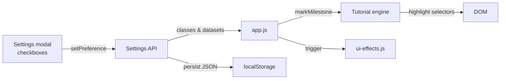

# Papers Empire – Developer Guide

This guide tracks Papers Empire 0.26.0 after the long-term progression release,
the toolchain, and the modules you’ll touch most often. GitHub issue
[#34](https://github.com/nclsppr/papersempire/issues/34) is the source
specification for the career rules.

## 1. Runtime Overview
- **Local game:** simulation and saves run in the browser. `index.html` loads
  plain JS modules in the order listed in the markup. The separate, optional
  [engagement endpoint](engagement.md) does not host game state.
- **Stateful loop:** `app.js` owns orchestration, rendering, localisation and
  saves. `progression.js`, `endgame.js`, `events.js` and `modifier-utils.js`
  expose the career, contract, incident and modifier rules without owning UI.
  A cached `DOM` map avoids repeated query selectors during frames.
- **Settings & tutorial:** `accessibility.js` exposes a `Settings` API that other modules (tutorial, UI effects, app) consume to apply preferences instantly.
- **Effects:** `ui-effects.js` centralises particles + audio beeps; `tutorial.js` manages the guided tour overlay and exposes `markMilestone()` for app integration.
- **Mobile and offline:** see [the integration contract](mobile-offline.md) for
  panel navigation, portable save previews, installation, cache updates and iOS.

## 2. File Structure (simplified)
```
papersempire/
├── index.html
├── assets/
│   ├── css/style.css
│   ├── i18n/{fr,en,de,lb}.js
│   └── js/
│       ├── asset-url.js          # Release stamp for runtime-built asset URLs
│       ├── app.js
│       ├── accessibility.js      # Settings store + preference wiring
│       ├── achievements.js
│       ├── events.js             # Narrative event system
│       ├── endgame.js            # Contracts, clauses & timer state
│       ├── progression.js        # Plans, challenges, campaigns & milestones
│       ├── persistence.js
│       ├── modifier-utils.js
│       ├── godmode-utils.js
│       ├── ui-effects.js         # Particles + audio cues
│       └── tutorial.js           # Guided onboarding flow
├── docs/ (Retype sources)
│   ├── accessibility.md
│   ├── DOCUMENTATION.md (this file)
│   ├── RELEASE_NOTES.md
│   └── …
├── package.json
├── scripts/validate-i18n.mjs
├── scripts/validate-progression.mjs
├── scripts/validate-gameplay-modules.mjs
└── retype.yml
```

## 3. Key Modules
- **app.js:** entry point. Sets up the DOM cache, localisation, render loop,
  god mode, Dossier, rewards, log, non-blocking incident inbox and save V3.
  Imports helpers via global variables.
- **asset-url.js:** carries the immutable build revision from its script URL to
  generated building thumbnails and dynamically imported Three.js resources.
- **accessibility.js:** exposes `Settings` with `getPrefs`, `getPreference`, `setPreference`, and `refresh`. Toggling a setting updates `document.documentElement` immediately and persists to `pe-accessibility`.
- **ui-effects.js:** small particle factory + Web Audio tones. Respects `documentElement.dataset` flags so you can disable sounds or particles without touching the module.
- **tutorial.js:** keeps tutorial steps in memory, controls the overlay, and listens for `markMilestone()` calls. It is intentionally decoupled so we can script custom flows in the future.
- **progression.js:** pure, serialisable career state. It defines three Plans
  with three ranks, optional challenges, campaigns, building milestones and the
  conclusion. Rewards are returned to `app.js` so state and credit are saved
  together.
- **modifier-utils.js:** composes Plan, permanent career, prestige, building and
  upgrade modifiers once per calculation path.
- **events.js:** random incidents and minigames. It owns cadence and the single
  pending definition; `app.js` decides when the player opens or archives it.
- **endgame.js:** exposes `EndgameModule`, the contract and optional clause
  catalogue, immutable terms calculated at acceptance, the active timer and
  prepress duration reduction. It does not inject translations.
- **achievements.js:** pure definitions, progress functions and rewards. The app
  persists unlock and reward receipts separately for exactly-once credit.
- **persistence.js:** thin wrapper around localStorage that serialises the `gameState` slices.

## 4. Settings & Tutorial Flow


## 5. Validation & Commands
- **JavaScript:** use `node --check` on every changed script; pure UMD helpers
  can additionally be exercised from Node.
- **Gameplay:** `npm run gameplay:check` validates Plan progression, idempotent
  milestones, contracts, clauses, save migration and pure module behaviour.
- **I18n:** `npm run i18n:check` requires exact key parity and identical named
  placeholders in French, English, German and Luxembourgish, then checks
  runtime key references.
- **Static UI:** validate HTML, CSS, identifiers, ARIA references and all four
  i18n catalogs before publication.
- **Résilience UI:** `npm run ui:check` vérifie les contrats BFCache, fallback
  contraste élevé/première frame, fente de presse, cache runtime, source de
  marque canonique et emblème analytique peint. La validation Cloudflare
  l'exécute avant le build.
- **Docs:** `npm run docs:build` generates the Retype site into `docs-site/`; the canonical site build publishes it below `/docs/`.
- **Delivery:** `npm run cloudflare:check` assembles the full site, validates the
  Worker and performs a Wrangler dry run. Cloudflare Workers Builds deploys
  `main` with `npm run cloudflare:check` followed by `npm exec wrangler deploy`.
- **Limite actuelle:** le dépôt ne contient pas de suite navigateur complète.
  Les parcours clavier, Safari/iPhone et WebGL doivent donc encore être
  contrôlés dans de vrais navigateurs avant de déclarer une release validée.

## 6. Documentation & Releases
- Retype sources live in `docs/`. Add a new Markdown file per major feature (events, accessibility, endgame, balance…).
- `docs/RELEASE_NOTES.md` is the canonical changelog. Update it whenever you land a sizeable batch of changes; `AGENTS.md` points to it for release tracking.

## 7. Dossier, Contracts & Journal

- The Dossier is the only guidance surface. It prioritises the active contract,
  otherwise showing the current Plan step and one relevant challenge or
  campaign action. It does not mirror a separate quest list.
- The right-column card exposes contracts and the activity journal as tabs.
  `switchDetailTab()` only toggles visibility and ARIA state; game state remains
  independent from the selected tab.
- `EndgameModule` surfaces up to three offers, enforces quality, image, volume
  and building requirements, and freezes duration plus reward multipliers when
  a contract is accepted. The base delivery reward is guaranteed. The optional
  clause bonus is paid only if quality/image never drops below its threshold or
  footprint never rises above it during production.
- Each Studio prépresse shortens nominal contract duration by 6%, capped at 30%
  and with a 15-second floor. This duration effect uses raw quantity, not the
  ×10/×25 milestone multiplier.
- The 30-second offer refresh throttle remains visible through
  `contracts.rerollCountdown`. A completed contract is recorded into career
  counters and can advance a Plan, challenge or campaign.
- The Journal renders durable, translated feedback for objectives, challenges,
  campaigns, clauses, milestones, rewards and incidents. Transient banners can
  be dismissed without losing that history.

## 8. Save V3 and migration

The canonical `papersEmpireSave` object contains:

```text
version, meta, resources, stats, buildings, upgrades,
achievements { unlocked, rewarded }, career,
endgame { activeContract }, events { pendingId }, analytics, lastSeen
```

`career` is produced by `Progression.serializeCareer()`. The contract export
includes its own schema version, timer, duration, frozen terms and clause state.
Only the pending incident ID is stored because event definitions remain code.

Loading is additive and defensive. V1/V2 resources, buildings, upgrades and
flat achievements are accepted; renamed stats/buildings migrate, missing
career data starts cleanly, and previously unlocked achievements are treated as
already rewarded so an upgrade cannot duplicate currency. Unknown IDs and
invalid numbers are ignored. The new Studio starts at quantity zero for old
saves, with no reset.

## 9. Next Steps
- Expand UI effects with reusable animation presets (purchase streaks, tutorial callouts).
- Instrument automated accessibility checks (axe, Playwright) in CI.
- Break `app.js` into dedicated controllers (buildings, upgrades, contracts) to reduce the monolith as features grow.
