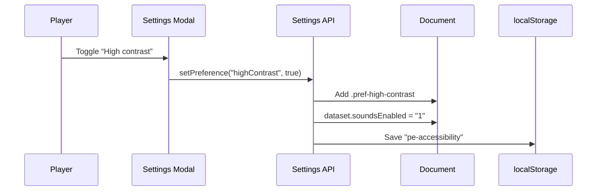

# Accessibility

Papers Empire targets WCAG 2.1 AA and RGAA recommendations. The client exposes a dedicated settings drawer and richer feedback; syntax, CSS and multilingual static-build checks complement the manual browser/device review.

## Settings Drawer
The ⚙️ button opens a modal built with four sections. All controls are native checkboxes/buttons, receive focus styles, and persist via `pe-accessibility` in `localStorage`.

- **Accessibility tab:** toggles for high contrast, large text (bumps the `:root` font-size), and reduced motion. Each option simply flips a `pref-*` class and is applied before `app.js` renders to avoid flashes.
- **Audio tab:** enables or disables UI bleeps produced by `ui-effects.js`. The toggle maps to `documentElement.dataset.soundsEnabled` so other modules can respect it without reading storage.
- **Interface tab:** controls the particle layer, the guided tutorial, and a toggle that pauses narrative events entirely. Players can re-run the tutorial at any time through the “Restart tutorial” button.
- **Save tab:** houses export/import/reset buttons so keyboard users can access them without scrolling through the right column.

## Visual & Audio Feedback
`ui-effects.js` centralises paper cues and minimal Web Audio beeps:

- Manual printing feeds a decorative sheet through the press; validated
  purchases, upgrades and contracts emit a short paper/stamp cue around the
  surface that actually changed.
- Buying the most expensive building kicks off a confetti celebration + celebration tone.
- All generated motion bails out when `pref-reduce-motion`, the system reduced
  motion preference, the “Particles” toggle or a hidden browser tab requires it.
- Audio is unlocked only after a real pointer/keyboard interaction, so a
  background contract completion cannot start a new audio session by itself.

## Touch and iPhone reliability

- `viewport-fit=cover` enables the safe-area insets used by the sticky header
  and footer; the bottom inset is consumed once by the footer.
- Anchor and sticky offsets include the top safe area, so navigation does not
  land underneath the expanded header on notched iPhones or in standalone mode.
- Under a coarse pointer, footer links and other structural links expose a
  minimum 44 px target and retain a visible active/tap state.
- Modal overlays use `pointer-events: auto` only while `.is-open`; the
  transparent closing frame cannot swallow a following tap.
- Settings, events and offline reports cannot stack; pending reports wait for
  the active surface to close. Tab stays inside the visible dialog, Escape
  cannot abandon an unresolved event, and focus returns to a durable action.
- The contracts list and activity log use render signatures instead of being
  destroyed and rebuilt on every animation frame. This preserves keyboard
  focus and reduces main-thread/garbage-collection pressure on mobile Safari.
- Continuous DOM refreshes are capped at 10 Hz while the simulation keeps its
  own animation-frame clock; multiplier reads are pure and cannot change a
  gauge merely because Three.js or the dashboard requested a snapshot.
- A machine or upgrade purchase restores focus to the corresponding rebuilt
  action (or the next logical action), instead of dropping keyboard and voice
  control back onto the document body.
- Continuous counters are not live regions. A dedicated atomic announcer only
  receives meaningful new activity messages.
- Une page restaurée par le BFCache Safari est rechargée une seule fois : cela
  évite de conserver une ancienne cascade CSS ou un contexte WebGL noir après
  un aller-retour vers la Data Science Zone.
- Le contraste élevé empêche le démarrage de Three.js et conserve le fallback
  DOM/CSS. Une scène déjà rendue revient elle aussi au fallback quand la
  préférence est activée.

## Guided Tutorial
`assets/js/tutorial.js` orchestrates a first-run overlay that highlights important modules (print button → buildings → journal → settings). It hooks into `Settings` to know whether the user already finished the flow, and exposes `markMilestone()` so `app.js` can advance steps when the player actually completes each action.

## Testing & Tooling

The repository intentionally has no full automated browser suite. Each visual
release runs syntax checks, CSS validation, i18n key/reference alignment, a
static multilingual build and `npm run ui:check` for the critical BFCache,
fallback, print-feed, cache-runtime and sub-brand contracts. This gate is
enforced by the Pages and VPS workflows. iPhone/Safari interaction still
requires a manual device pass before declaring device-specific rendering fully
verified.

## Preference Flow

## TODO / Ideas
- Axe-core + Playwright automation to catch regressions before shipping.
- Alternate color palettes (deuteranopia/protanopia) exposed as additional toggles.
- Narrated tooltips for the tutorial, possibly with Web Speech API for hands-free accessibility.
- Keyboard shortcut help sheet living near the settings drawer.
