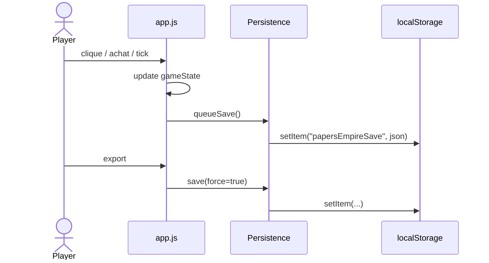
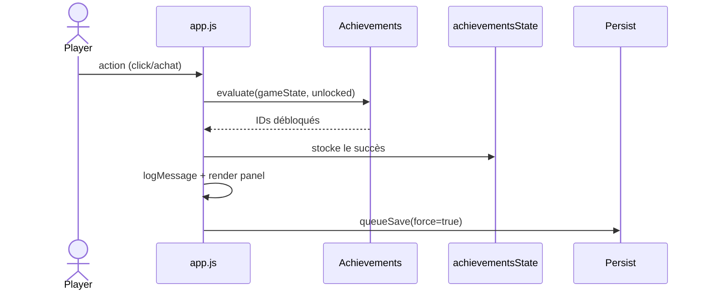

# Architecture

Cette page décrit la structure technique actuelle de Papers Empire. Elle résume les modules clés, les flux de données et présente deux diagrammes de séquence Mermaid.

## Pile Front-end

- **HTML** : `index.html` structure l’application (header sticky, 3 colonnes, panneau progression/sauvegarde).
- **CSS** : `assets/css/style.css` gère layout, responsive, thèmes accessibilité (classes `pref-*`).
- **JavaScript** :
  - `app.js` : boucle de jeu, render, interactions.
  - `persistence.js`, `achievements.js`, `accessibility.js`, `modifier-utils.js` : modules spécialisés.
  - I18n : `assets/i18n/*.js` se chargent via `<script>` et exposent `window.I18N`.

## Flux général

1. `index.html` charge les helpers, i18n, `accessibility.js`, puis `app.js` (defer).
2. `app.js` initialise `gameState`, applique la sauvegarde (si dispo), prépare les handlers et démarre `requestAnimationFrame`.
3. `persistence.js` encapsule `localStorage` (`save/load/clear/export/import`).
4. `accessibility.js` lit les préférences et applique des classes CSS avant le rendu pour éviter les flashs.

## Diagramme : Autosauvegarde

## Diagramme : Succès

## Modules principaux

| Fichier | Rôle |
| --- | --- |
| `assets/js/app.js` | Boucle principale, rendu, UI |
| `assets/js/persistence.js` | Sauvegarde locale, export/import |
| `assets/js/achievements.js` | Définition / évaluation des succès |
| `assets/js/accessibility.js` | Préférences high contrast / texte / motion |
| `assets/js/scene/*.js` | Campus 3D lowpoly (enrichissement progressif) |
| `assets/vendor/three.module.min.js` | three.js **0.185.1** vendored (+ `three.core.min.js`, importé par le premier) |
| `scripts/build-site.sh` | Assemblage reproductible du jeu et de la documentation |

### Scène 3D (assets/js/scene/)

La scène est un **enrichissement progressif** : `scene-loader.js` (script
classique) importe dynamiquement le module three.js vendored ; en cas d'échec
(`file://` des tests Playwright, WebGL absent, vieux navigateur, toggle
« scène 3D » désactivé) le fallback CSS reste affiché et le jeu DOM est
inchangé. La scène lit l'état via `window.__PE_SCENE__.getSnapshot()`
(copie défensive exposée par `app.js`) en polling dans sa propre boucle rAF —
elle ne mute jamais la simulation. `city-layout.js` place
les 11 parcelles ; `building-recipes.js` construit les bâtiments lowpoly en
géométries procédurales (aucun fichier de modèle 3D). Un printworks décoratif
permanent, une skyline, des nuages, routes, lampadaires et accessoires
instanciés rendent le campus lisible avant le premier achat sans falsifier
l'état de jeu. Le renderer transparent laisse le ciel CSS apparaître et utilise
ACESFilmicToneMapping ; le rendu vierge reste à 27 draw calls et 4 388 triangles.
`pref-reduce-motion`
fige la caméra et passe le rendu à la demande ; onglet caché ou stage hors
viewport = zéro rendu. Pour mettre à jour three.js : remplacer les deux
fichiers de `assets/vendor/` par ceux de la nouvelle version npm et noter la
version ici.

## Priorités futures

- Extraire la boucle `requestAnimationFrame` dans un module `loop.js` pour faciliter le throttling et les tests.
- Ajouter des tests Playwright + axe-core pour vérifier l’accessibilité.
- Formaliser un `events.js` pour les futurs mini-jeux + events scénarisés.

Le dépôt ne suit actuellement aucune suite de tests automatisés. Les mentions
historiques de Playwright/Node décrivent d'anciennes versions ; les validations
actuelles reposent sur les contrôles navigateur, la syntaxe JavaScript et
l'assemblage statique.

Voir aussi :
- [`accessibility.md`](accessibility.md)
- [`game-design.md`](game-design.md)
- [`codex-is-thinking.md`](codex-is-thinking.md)
