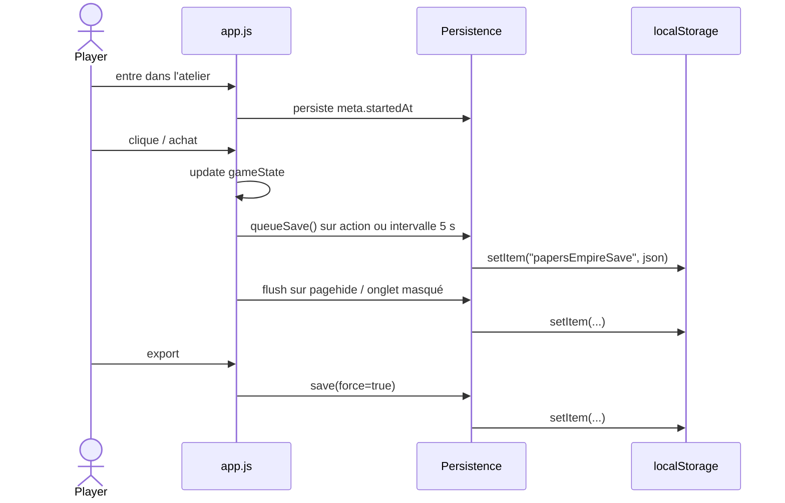
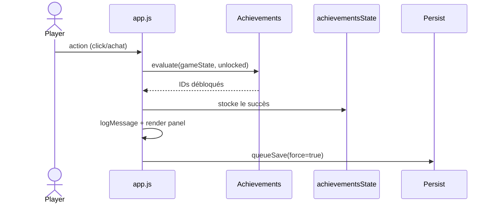

# Architecture

Cette page décrit le contrat technique de Papers Empire 0.23.1. Elle résume les
modules clés, les deux états de l'expérience, les flux locaux de données et les
limites de la Data Science Zone.

## Pile Front-end

- **HTML** : `index.html` porte le sas d'entrée et l'application de jeu ;
  `dashboard/index.html` porte la Data Science Zone autonome.
- **CSS** : `assets/css/style.css` conserve les fondations historiques et la
  couche V4 applique le monde « Production Twin », le passage landing/jeu, le
  responsive et les préférences `pref-*`.
- **JavaScript** :
  - `app.js` : boucle de jeu, projection DOM, contrôleur d'expérience et
    snapshots analytiques ;
  - `economy-analytics.js` : calculs purs d'économie marginale et de prestige ;
  - `dashboard.js` : rendu local et autonome de la Data Science Zone ;
  - `persistence.js`, `achievements.js`, `accessibility.js`,
    `modifier-utils.js` : modules spécialisés ;
  - I18n : `assets/i18n/*.js` se chargent via `<script>` et exposent `window.I18N`.

## Flux général

1. Un script précoce déduit la vue `landing` ou `playing` depuis la sauvegarde et
   l'URL afin d'éviter l'affichage transitoire de la mauvaise interface.
2. `index.html` charge les helpers, l'i18n, l'accessibilité, l'analytique pure,
   puis `app.js`.
3. `app.js` hydrate l'état et distingue la vérité durable
   (`meta.startedAt`) de la vue courante. Une sauvegarde ancienne avec progression
   est considérée comme déjà démarrée sans perdre ses données.
4. Une partie vierge reste inerte dans la landing. L'entrée explicite démarre la
   simulation, l'autosauvegarde et, si nécessaire, le tutoriel.
5. `persistence.js` encapsule `localStorage` (`save/load/clear/export/import`).
   `accessibility.js` applique les préférences avant rendu.

## Diagramme : Autosauvegarde



## Diagramme : Succès



## Modules principaux

| Fichier | Rôle |
| --- | --- |
| `assets/js/app.js` | Boucle principale, rendu, UI |
| `assets/js/economy-analytics.js` | Simulation pure quantité +1, coûts, gains marginaux et prestige |
| `assets/js/dashboard.js` | Data Science Zone, graphiques et tableaux à partir du stockage local |
| `assets/js/persistence.js` | Sauvegarde locale, export/import |
| `assets/js/achievements.js` | Définition / évaluation des succès |
| `assets/js/accessibility.js` | Préférences high contrast / texte / motion |
| `assets/js/asset-url.js` | Propage la révision du build aux assets dont le nom est assemblé au runtime |
| `assets/js/scene/*.js` | Production twin procédural (enrichissement progressif) |
| `assets/vendor/three.module.min.js` | three.js **0.185.1** vendored (+ `three.core.min.js`, importé par le premier) |
| `scripts/build-site.sh` | Assemblage reproductible du jeu et de la documentation |

### Scène 3D partagée (`assets/js/scene/`)

La scène est un **enrichissement progressif** partagé entre l'affiche et la
carte compacte du jeu : `scene-loader.js` (script
classique) importe dynamiquement le module three.js vendored ; en cas d'échec
(`file://`, WebGL absent, vieux navigateur, toggle
« scène 3D » désactivé) le fallback CSS reste affiché et le jeu DOM est
inchangé. Le loader ne pose `scene-active` qu'après l'événement de première
frame valide ; contraste élevé, perte de contexte et retour BFCache ne peuvent
donc pas remplacer le matte par un canvas vide. La scène lit l'état via
`window.__PE_SCENE__.getSnapshot()`
(copie défensive exposée par `app.js`) en polling dans sa propre boucle rAF —
elle ne mute jamais la simulation. Les interactions d'achat du canvas sont
désactivées hors de la vue `playing` et réutilisent les règles métier du DOM.
`city-layout.js` place les 11 parcelles ; `building-recipes.js` construit les
bâtiments en géométries procédurales avec matériaux PBR et ressources partagées.
Un printworks décoratif permanent rend une sauvegarde vierge lisible sans
prétendre que le joueur le possède. Le renderer transparent laisse le matte
painting porter l'horizon : la scène ne superpose plus une seconde skyline.
`pref-reduce-motion`
fige la caméra et réduit fortement la cadence ; onglet caché ou stage hors
viewport suspendent le rendu avec un faible polling de garde. Pour mettre à jour three.js : remplacer les deux
fichiers de `assets/vendor/` par ceux de la nouvelle version npm et noter la
version ici.

Les budgets cibles V4 sont détaillés dans
[`design-system.md`](design-system.md). Ils doivent être mesurés sur desktop et
iPhone avant d'être décrits comme atteints ; les nombres de rendu historiques
ne constituent pas une validation de la nouvelle recette.

### Data Science Zone et stockage local

La Data Science Zone ne lit pas directement `gameState`. Le jeu publie un
snapshot versionné et un historique borné dans `localStorage`. La page
`/dashboard/` les lit au chargement, puis écoute les événements `storage` pour
se mettre à jour entre onglets.

```mermaid
sequenceDiagram
    participant Loop as Boucle de jeu
    participant Econ as economy-analytics.js
    participant Store as localStorage
    participant Zone as Data Science Zone
    Loop->>Econ: état défensif de l'économie
    Econ-->>Loop: cadence, investissements +1, prestige
    Loop->>Store: snapshot v2 périodique
    Loop->>Store: échantillon historique borné
    Store-->>Zone: chargement ou événement storage
    Zone->>Zone: graphiques, matrice, recommandations
```

La sauvegarde canonique V2 conserve aussi le contrat premium actif et son temps restant :
ouvrir la Data Science Zone dans le même onglet ne détruit donc plus la mission.
Une réorganisation annule explicitement ce contrat et régénère les offres selon
le nouveau cycle.

Les calculs sont explicables et déterministes : coût suivant, gain marginal
DOC/s et CC/s, temps d'accès et retour en DOC à cadence constante. Ils ne sont
pas une simulation prédictive complète. L'historique ne commence qu'après
l'installation de la V4, reste dans le navigateur courant et peut être partiel
après migration, import ou effacement du stockage. Aucune télémétrie distante
n'est envoyée et aucune synchronisation entre appareils n'est promise.

## Priorités futures

- Extraire la boucle `requestAnimationFrame` dans un module `loop.js` pour faciliter le throttling et les tests.
- Ajouter des tests Playwright + axe-core pour vérifier l’accessibilité.
- Formaliser un `events.js` pour les futurs mini-jeux + events scénarisés.
- Si un historique multi-appareil est un jour requis, concevoir explicitement
  consentement, schéma, rétention et confidentialité avant d'ajouter un backend.

Le dépôt ne suit actuellement aucune suite navigateur complète. Le check Node
`npm run ui:check` verrouille néanmoins les contrats de résilience iPhone les
plus fragiles et est exécuté dans les workflows Pages et VPS ; les validations
finales reposent encore sur ce check, la syntaxe JavaScript, l'assemblage
statique et les contrôles navigateur/appareil.

Voir aussi :
- [`accessibility.md`](accessibility.md)
- [`game-design.md`](game-design.md)
- [`codex-is-thinking.md`](codex-is-thinking.md)
