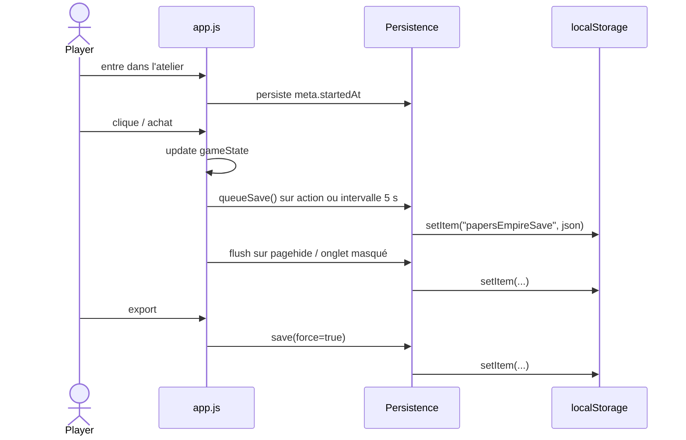
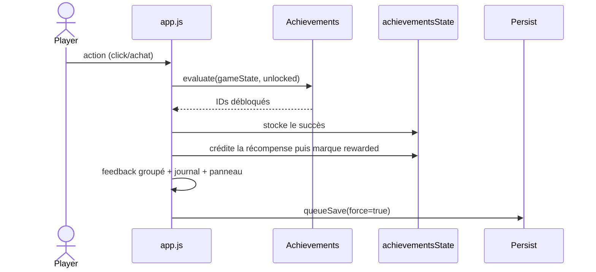
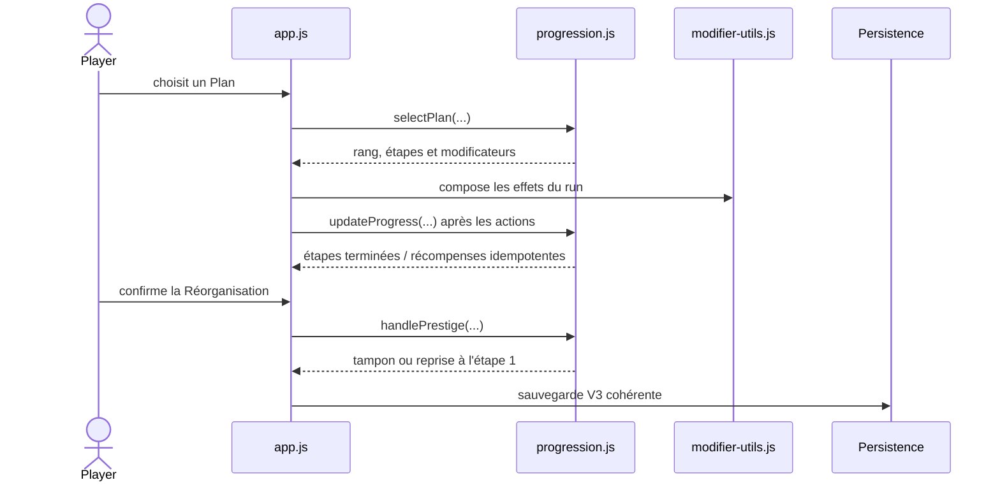

# Architecture

Cette page décrit le contrat technique du code de Papers Empire. Elle résume les
modules clés, les deux états de l'expérience, les flux locaux de données et les
limites de la Data Science Zone.

La spécification fonctionnelle de la progression longue est l'issue GitHub
[#34](https://github.com/nclsppr/papersempire/issues/34) ; cette page décrit son
contrat d'intégration, pas un second jeu de règles.

## Pile Front-end

- **HTML** : `index.html` porte le sas d'entrée et l'application de jeu ;
  `dashboard/index.html` porte la Data Science Zone autonome ; les hubs et
  articles `/guides/` sont générés en HTML statique depuis le catalogue
  éditorial. L’accueil, les guides et la 404 exposent la même structure de
  header global, avec des destinations rendues pour la langue courante.
- **CSS** : `assets/css/style.css` conserve les fondations historiques et la
  couche V4 applique le monde « Production Twin », le passage landing/jeu, le
  responsive et les préférences `pref-*`. `site-header.css` est la source
  commune du logo, du shell sticky, de la navigation et de leurs breakpoints.
  La release publie ces feuilles sous des noms `*.<sha>.css` afin que chaque
  révision utilise une nouvelle clé de cache. `guides.<sha>.css` reste limitée
  à la surface de lecture et ne charge pas le CSS complet du jeu.
- **JavaScript** :
  - `app.js` : boucle de jeu, projection DOM, contrôleur d'expérience et
    snapshots analytiques ;
  - `progression.js` : règles pures de Plans, défis, campagnes, paliers et
    conclusion ;
  - `modifier-utils.js` : composition pure des multiplicateurs de carrière,
    prestige, bâtiments et améliorations ;
  - `endgame.js` : catalogue de contrats, termes figés, clauses et minuterie ;
  - `events.js` : tirage et résolution des incidents sans responsabilité UI ;
  - `economy-analytics.js` : calculs purs d'économie marginale et de prestige ;
  - `dashboard.js` : rendu local et autonome de la Data Science Zone ;
  - `persistence.js`, `achievements.js`, `accessibility.js`,
    `modifier-utils.js` : modules spécialisés ;
  - `save-transfer.js` : fichiers portables, aperçu d’import et récupération ;
  - `mobile-experience.js`, `empire-view.js` : navigation mobile et projection
    de l’empire, sans seconde simulation ;
  - `investment-advice.js` : classement des achats selon l’objectif choisi ;
  - `offline-install.js`, `sw.js` : préparation du jeu Web hors ligne et
    activation explicite des mises à jour ;
  - `engagement.js` : observations d’étapes facultatives, séparées des sauvegardes ;
  - I18n : `assets/i18n/*.js` se chargent via `<script>` et exposent `window.I18N`.

## Flux général

1. Un script précoce déduit la vue `landing` ou `playing` depuis la sauvegarde et
   l'URL afin d'éviter l'affichage transitoire de la mauvaise interface.
2. `index.html` charge les helpers, l'i18n, l'accessibilité, l'analytique pure,
   puis `app.js`.
3. `app.js` hydrate l'état et distingue la vérité durable
   (`meta.startedAt`) de la vue courante. Une sauvegarde ancienne avec progression
   est considérée comme déjà démarrée sans perdre ses données.
4. Une partie vierge reste inerte dans la landing. L'entrée explicite démarre la
   simulation, l'autosauvegarde et, si nécessaire, le tutoriel.
5. `persistence.js` encapsule `localStorage`, valide les fichiers importés et
   vérifie les écritures. `save-transfer.js` ajoute aperçu et confirmation.
   `accessibility.js` applique les préférences avant rendu.

## Diagramme : Autosauvegarde



## Diagramme : Succès



## Diagramme : validation d'un Plan



## Modules principaux

| Fichier | Rôle |
| --- | --- |
| `assets/js/app.js` | Boucle principale, rendu, UI |
| `assets/js/progression.js` | État et règles pures de carrière : Plans, défis, campagnes, paliers et conclusion |
| `assets/js/modifier-utils.js` | Composition déterministe des modificateurs d'économie |
| `assets/js/endgame.js` | Offres de contrats, clauses optionnelles, termes figés et persistance du contrat actif |
| `assets/js/events.js` | Catalogue, cadence et résolution des incidents en attente |
| `assets/js/economy-analytics.js` | Simulation pure quantité +1, coûts, gains marginaux et prestige |
| `assets/js/dashboard.js` | Data Science Zone, graphiques et tableaux à partir du stockage local |
| `assets/js/persistence.js` | Sauvegarde locale, export/import |
| `assets/js/save-transfer.js` | Fichier portable partagé Web/iOS, aperçu et récupération de la partie précédente |
| `assets/js/mobile-experience.js` | Navigation par panneaux, achat suggéré et état de sauvegarde sur mobile |
| `assets/js/empire-view.js` | Projection graphique et contrôles accessibles de l’empire |
| `assets/js/investment-advice.js` | Recommandations DOC, CC, qualité, empreinte ou objectif courant |
| `assets/js/career-share.js` | Création locale d’une carte de carrière à partager à la demande |
| `assets/js/offline-install.js` | Préparation, état et actions explicites d’installation/mise à jour Web |
| `sw.js`, `scripts/build-offline.mjs` | Cache des ressources publiques, intégrité et empreinte des octets finaux |
| `assets/js/engagement.js`, `worker/engagement.mjs` | Mesure facultative et endpoint borné, sans état de jeu |
| `assets/js/achievements.js` | Définition / évaluation des succès |
| `assets/js/accessibility.js` | Préférences high contrast / texte / motion |
| `assets/js/asset-url.js` | Propage la révision du build aux assets dont le nom est assemblé au runtime |
| `assets/js/scene/*.js` | Production twin procédural (enrichissement progressif) |
| `assets/vendor/three.module.min.js` | three.js **0.185.1** vendored (+ `three.core.min.js`, importé par le premier) |
| `assets/css/site-header.css` | Header global partagé par l’accueil, les guides et la 404 |
| `scripts/build-site.sh` | Assemblage reproductible du jeu et de la documentation |
| `content/guides/index.mjs` | Catalogue, traductions, sources et métadonnées des Guides de l'atelier |
| `scripts/build-guides.mjs` | Génération des hubs, articles, données structurées et sitemap |

Les catalogues `assets/i18n/{fr,en,de,lb}.js` sont l'unique source des textes
runtime, y compris les contrats. Les modules métier ne mutent plus `window.I18N`.
`scripts/validate-i18n.mjs` impose la parité stricte des clés et des placeholders
entre les quatre langues, puis vérifie que les clés littérales appelées par le
runtime sont résolues.

### Guides de l’atelier

Les Guides sont une surface statique indexable, séparée de `/docs/` qui reste
technique et `noindex`. Le catalogue contient les quatre traductions publiées,
les slugs, les dates, les images et les sources. Le générateur en dérive
trente-six pages de guides et le sitemap de production ; il n’existe plus de sitemap manuel à tenir
en parallèle.

Chaque famille de pages possède des alternates `fr`/`en`/`de`/`lb` réciproques
et un `x-default` français. Les articles exposent `Article` et
`BreadcrumbList`, le hub `CollectionPage` et `ItemList`. Le générateur rend le
header global, ses actions localisées et l’état actif de l’Atelier sur le hub
comme sur les articles. Les guides ne chargent ni `app.js`, ni les catalogues
i18n du navigateur, ni Three.js : le contenu principal, les langues et les
destinations de navigation sont rendus au build.

Les huit articles couvrent aussi le démarrage pratique, DOC/CC/Plans, la
première réorganisation et un exemple d’investissement synthétique. Ce dernier
utilise le helper économique canonique au build sans lire les données d’un
joueur. Les liens d’action portent l’identifiant du guide et une ancre du jeu ;
les liens d’aide sont générés depuis le catalogue. Les quatre pages d’accueil
et trente-six pages de guides forment quarante URLs canoniques dans le sitemap.

### Scène 3D partagée (`assets/js/scene/`)

La scène est un **enrichissement progressif** partagé entre l'affiche et la
carte compacte du jeu : `scene-loader.js` (script
classique) importe dynamiquement le module three.js vendored ; en cas d'échec
(`file://`, WebGL absent, vieux navigateur, toggle
« scène 3D » désactivé) le fallback CSS reste affiché et le jeu DOM est
inchangé. Le loader ne pose `scene-active` qu'après l'événement de première
frame valide ; contraste élevé, perte de contexte et retour BFCache ne peuvent
donc pas remplacer le matte par un canvas vide. La scène lit l'état via
`window.__PE_SCENE__.getSnapshot()`
(copie défensive exposée par `app.js`) en polling dans sa propre boucle rAF —
elle ne mute jamais la simulation. Les interactions d'achat du canvas sont
désactivées hors de la vue `playing` et réutilisent les règles métier du DOM.
`city-layout.js` place les 12 parcelles ; `building-recipes.js` construit les
bâtiments en géométries procédurales avec matériaux PBR et ressources partagées.
Un printworks décoratif permanent rend une sauvegarde vierge lisible sans
prétendre que le joueur le possède. Le renderer transparent laisse le matte
painting porter l'horizon : la scène ne superpose plus une seconde skyline.
`pref-reduce-motion`
fige la caméra et réduit fortement la cadence ; onglet caché ou stage hors
viewport suspendent le rendu avec un faible polling de garde. Pour mettre à jour three.js : remplacer les deux
fichiers de `assets/vendor/` par ceux de la nouvelle version npm et noter la
version ici.

Les budgets cibles V4 sont détaillés dans
[`design-system.md`](design-system.md). Ils doivent être mesurés sur desktop et
iPhone avant d'être décrits comme atteints ; les nombres de rendu historiques
ne constituent pas une validation de la nouvelle recette.

### Data Science Zone et stockage local

La Data Science Zone ne lit pas directement `gameState`. Le jeu publie un
snapshot versionné et un historique borné dans `localStorage`. La page
`/dashboard/` les lit au chargement, puis écoute les événements `storage` pour
se mettre à jour entre onglets.

```mermaid
sequenceDiagram
    participant Loop as Boucle de jeu
    participant Econ as economy-analytics.js
    participant Store as localStorage
    participant Zone as Data Science Zone
    Loop->>Econ: état défensif de l'économie
    Econ-->>Loop: cadence, investissements +1, prestige
    Loop->>Store: snapshot v2 périodique
    Loop->>Store: échantillon historique borné
    Store-->>Zone: chargement ou événement storage
    Zone->>Zone: graphiques, matrice, recommandations
```

### Sauvegarde canonique V3

`papersEmpireSave` porte `version: 3`. `app.js` sérialise uniquement les données
durables, jamais le DOM ni les caches de rendu :

| Champ | Contenu durable |
| --- | --- |
| `meta` | date du premier démarrage explicite |
| `resources`, `stats` | DOC, CC, Culture et trois jauges |
| `buildings`, `upgrades` | identifiants, quantités, déblocages et achats |
| `achievements` | cartes `unlocked` et `rewarded`, séparées pour garantir une récompense unique |
| `career` | état normalisé par `Progression.serializeCareer()` : cycle, Plan/rang/étape, compteurs, défis, campagnes, badges et conclusion |
| `endgame.activeContract` | contrat, temps restant, durée, termes figés et état de clause (`schemaVersion: 2`) |
| `events.pendingId` | identifiant de l'unique incident en attente |
| `analytics`, `lastSeen` | compteurs locaux, résumés de cycles et calcul de l'absence |

L'hydratation est défensive : seules les ressources finies et non négatives, les
quantités entières sûres et les identifiants connus sont repris. Les anciennes
sauvegardes V1/V2 restent acceptées ; `imageVbs` migre vers `brandImage`,
`vbsPortal` vers `clientPortal`, l'ancien objet plat de succès devient
`achievements.unlocked`, et ces succès historiques sont marqués récompensés
pour ne pas recréditer leur lot. Les champs carrière, clause ou incident absents
reçoivent leurs valeurs initiales. Le Studio prépresse apparaît à quantité zéro
dans une sauvegarde ancienne. Aucun reset forcé n'est nécessaire.

Une réorganisation annule explicitement le contrat actif, redémarre le cycle
de carrière et régénère les offres. Un Plan incomplet et une campagne active
repartent à l'étape 1 ; un défi actif échoue. Les tampons, badges, défis déjà
terminés, récompenses de succès et Culture restent persistants.

### Dossier et incidents

`app.js` projette la prochaine étape du Plan, le défi ou la campagne disponible
et le contrat actif dans un seul « Dossier du moment ». Le contrat ne remplace
pas le système d'offres : il prend seulement la priorité dans cette synthèse
pendant son exécution. La carrière est évaluée par `progression.js`, qui ne
connaît ni DOM, ni traduction, ni stockage ; `app.js` applique les récompenses
retournées dans la même sauvegarde que l'état terminé.

La préférence `eventsEnabled`, gérée par `accessibility.js`, persiste
l'autorisation des incidents. Un tirage crée une bannette discrète et sauvegarde
son identifiant, sans ouvrir la modale. Le joueur choisit de l'ouvrir ou de le
classer sans effet. Tant qu'un incident attend, `events.js` n'en génère pas un
second. Désactiver les incidents vide la bannette et empêche les prochains
tirages.

Les calculs sont explicables et déterministes : coût suivant, gain marginal
DOC/s et CC/s, temps d'accès et retour en DOC à cadence constante. Ils ne sont
pas une simulation prédictive complète. L'historique ne commence qu'après
l'installation de la V4, reste dans le navigateur courant et peut être partiel
après migration, import ou effacement du stockage. Le snapshot et l’historique
ne sont pas transmis et aucune synchronisation entre appareils n’est promise.
La [mesure facultative des étapes](engagement.md) possède un consentement et un
schéma distincts, sans sauvegarde ni identifiant de joueur.

### Mobile, transferts et ressources hors ligne

Le [contrat mobile et hors ligne](mobile-offline.md) décrit les projections
Web/iOS, le fichier `.papersempire`, l’aperçu avant remplacement et la copie
de récupération. Il définit aussi les ressources autorisées dans le cache,
leur vérification, l’activation explicite d’une mise à jour et ses limites.
Le cache de l’application et le stockage de la partie sont indépendants.

## Priorités futures

- Extraire la boucle `requestAnimationFrame` dans un module `loop.js` pour faciliter le throttling et les tests.
- Ajouter des tests Playwright + axe-core pour vérifier l’accessibilité.
- Si un historique multi-appareil est un jour requis, concevoir explicitement
  consentement, schéma, rétention et confidentialité avant d'ajouter un backend.

Le dépôt ne suit actuellement aucune suite navigateur complète. Le check Node
`npm run ui:check` verrouille néanmoins les contrats de résilience iPhone les
plus fragiles et est exécuté dans la validation Cloudflare ; les validations
finales reposent encore sur ce check, la syntaxe JavaScript, l'assemblage
statique et les contrôles navigateur/appareil.

Voir aussi :
- [`accessibility.md`](accessibility.md)
- [`game-design.md`](game-design.md)
