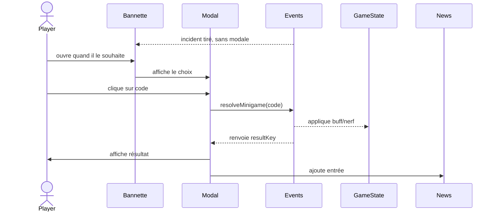

# Events & Mini-games

Pour casser la monotonie, Papers Empire introduit des incidents contextuels
générés aléatoirement. Un incident propose un choix ou un mini-jeu, mais ne
bloque ni la production ni l'interface : il attend dans une bannette jusqu'à ce
que le joueur décide de l'ouvrir.

## Système

- **Génération** : le premier événement ne peut pas apparaître avant 2 min 30.
  Après une résolution ou une fermeture, le suivant attend au moins 4 min 30.
  Sa probabilité augmente avec la production, sur le temps réel plutôt que sur
  le nombre d'images ou l'accélération du mode test.
- **Types** : `choice` (boutons avec conséquences immédiates) et `minigame` (interaction spéciale).
- **Bannette** : un seul incident peut attendre. Son arrivée affiche un signal
  discret et une entrée de journal, sans ouvrir de modale. Tant qu'il est en
  attente, le tirage est suspendu.
- **Contrôle** : le joueur ouvre volontairement la modale. La croix et `Échap`
  classent alors l'incident sans appliquer de choix et déclenchent le même
  délai de garde qu'une résolution. « Stopper ces interruptions » vide la
  bannette et désactive durablement les tirages ; le réglage Interface permet
  de les réactiver.
- **Persistance** : `events.pendingId` conserve l'identifiant de la bannette
  dans la sauvegarde V3. Au rechargement, une définition encore connue est
  restaurée ; un identifiant obsolète est ignoré sans casser la partie.
- **Intégration** : attente, classement et résultat sont consignés dans le
  journal avec des clés traduites. Le bandeau de feedback est bref et peut être
  fermé ; le détail reste dans le journal.
- **Debug** : `window.__PE_DEBUG.spawnEvent("machineBreakdown")` permet de forcer un événement (utilisé par les tests Playwright).

## Catalogue (v1)

| ID | Type | Effet | Notes |
| --- | --- | --- | --- |
| paperShortage | choice | DOC/qualité vs empreinte/qualité | choix de papier |
| influencerVisit | choice | DOC/image vs image/qualité | visite LinkedIn |
| greenAudit | choice | DOC/empreinte vs empreinte/image | audit carbone |
| machineBreakdown | choice | Réparer vs ignorer (DOC/qualité) | perte de DOC mais qualité ++ |
| auditQuality | choice | Contrôle complet vs superficiel | confiance +/- |
| newContract | choice | +DOC vs confiance | augmente l’empreinte |
| cyberAttack | choice | Débrancher (perte DOC) vs payer (perte CC) | | 
| sabotage | choice | Enquêter (image +) vs ignorer (image -) | |
| calibrationChallenge | minigame | Faire correspondre le code au bouton | mini-jeu de calibrage |

## Mini-jeu : calibrage

1. L’événement `calibrationChallenge` génère un code (1,2,3).
2. L’utilisateur doit cliquer sur le bouton correspondant.
3. Succès = +DOC / +qualité, échec = baisse qualité.

## TODO futurs

- Ajouter des événements conditionnés par les stats (ex: si footprint trop haut, visite des autorités).
- Mini-jeux supplémentaires (tri des colis, puzzle triage, etc.).
- Support audio/graphique pour rendre les événements plus immersifs.

La bannette non bloquante répond au périmètre de l'issue GitHub
[#34](https://github.com/nclsppr/papersempire/issues/34). Une file multi-incidents
reste volontairement hors périmètre : elle recréerait une seconde liste de
tâches et de la pression artificielle.
